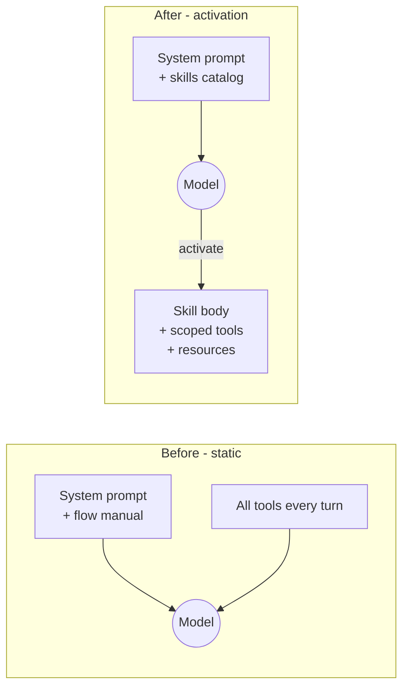

# Report Format (portable Markdown + Mermaid)

The report is a **Markdown file** with **Mermaid** diagrams. No HTML, no browser, no
external CSS — it must read cleanly in any Markdown viewer or plain text. Save it to a
file (e.g. `agentic-architecture-review.md` in the project root or a location the
user names) and tell the user the absolute path.

## Structure

```
# Agentic Architecture Review — <project / scope>

<one-paragraph summary: how many flows examined, how many migrate, the headline>

## Architecture rubric (lean)
<one line per check 1-4: pass / finding, with a file:line or prompt pointer>

## Flow findings
<one card per flow — see the card template>

## Top recommendation
<the single flow to migrate (or fix) first, and why>

## Grounding
<the LangChain4j / skills version detected, and the note that perishable API names
were grounded against it; primary-source links>
```

## The per-flow card

Each flow gets one card:

```
### Flow: <name> — Verdict: <Migrate | Keep static | Split | Defer to tool-architect>

**What it does:** <one or two lines>
**Where it lives:** <system-prompt block + tools + any inlined knowledge, with file:line>

**Migration scorecard**

| Signal (for)                | Present? | Counter-signal (against)        | Present? |
| --------------------------- | -------- | ------------------------------- | -------- |
| Conditional relevance       | yes/no   | Hot path / every turn           | yes/no   |
| Procedural weight in prompt | yes/no   | Latency-sensitive               | yes/no   |
| Cohesive cluster            | yes/no   | Lone tool, no instr./resources  | yes/no   |
| Externalizable knowledge    | yes/no   | No clean trigger                | yes/no   |
| Deterministic trigger       | yes/no   | No bloat to fight               | yes/no   |

**Verdict rationale:** <which signals dominated; the deciding factor>
**Activation trigger (if migrating):** <the one-sentence trigger for the description>
**Authorization note:** <unchanged seam — activation is not an auth boundary>

**Before / after**

<a Mermaid diagram: static prompt + full surface  →  catalog + activated skill>
```

## Before/after diagram pattern

Use Mermaid to show the *gating* change — what the model sees before vs after:



Keep diagrams small and about the *structure that changed* — the shrunk prompt and
the hidden-until-activated surface — not the whole system.

## Discipline

- One verdict per flow; never leave a flow unscored.
- Cite a `file:line` (or a prompt location) for every claim.
- Separate **durable** structure findings from **perishable** version notes.
- In audit mode, end by asking which flows to pursue — do not pre-implement.
